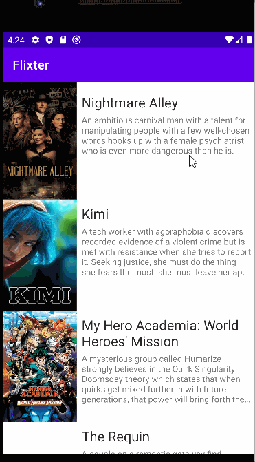

# Flixter
Flixter movie app for CodePath
**Flixter** This project lets users view a list of movies sourced from the The Movie Database API.

Submitted by: **Evgeniya Titkova**

Time spent: **1.5** hours spent in total

## User Stories

The following **required** functionality is completed:

* [x] User can ** view a list of movies (title, poster image, and overview) currently playing in theaters from the Movie Database API. **
The following **optional** features are implemented:

* [ ]Views should be responsive for both landscape/portrait mode.
   * [ ]In portrait mode, the poster image, title, and movie overview is shown.
   * [ ]In landscape mode, the rotated alternate layout should use the backdrop image instead and show the title and movie overview to the right of it.
* [ ] Display a nice default placeholder graphic for each image during loading (read more about Glide). If you're running your app on an emulator, you can change the network speed of the emulator to test this feature by following the guidance here. 

* [ ]Improve the user interface through styling and coloring 

* [ ]For popular movies (i.e. a movie voted for more than 5 stars), the full backdrop image is displayed. Otherwise, a poster image, the movie title, and overview is listed. Use Heterogenous RecyclerViews and use different ViewHolder layout files for popular movies and less popular ones.

## Video Walkthrough

Here's a walkthrough of implemented user stories:

GIF created with [LiceCap](http://www.cockos.com/licecap/).
